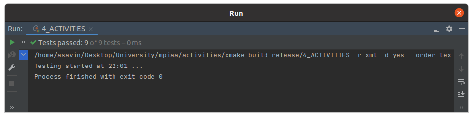

# Практическое занятие № 4: Динамическое программирование, жадные алгоритмы

## Часть 2

В работе представлен алгоритм поиска наибольшего подмножества взаимно совместных процессов `get_max_activities`.
Алгоритм имеет две реализации:
1) native 
2) greedy

За тип используемой реализации отвечает макрос NATIVE, в случае 1 - используется нативная реализация, 
в случае 0 - жадный алгоритм.

### Алгоритмическая сложность

1) native (полный перебор) - O(n ^ 2 * 2 ^ n)
2) greedy - O (n * ln(n) + n)

Сложность жадного алгоритма указана с учётом прохода по всем элементам (+ n).
Для нативного алгоритма я нашёл интересную реализацию перебора все возможных подмножеств множества, 
через использование битовых масок. Если интересно, можете ознакомиться. 
https://www.geeksforgeeks.org/find-distinct-subsets-given-set

### Unit-tests

### Замеры времени

Замеры были проведены на `release` версии с флагом оптимизации `-O2`.

Для всех замеров ниже количество элементов множества в котором ведётся поиск, бралось как `N`.

| Algorithm / Size of activities set (N) | 10         | 20         | 25         | 28          |
|----------------------------------------|------------|------------|------------|-------------|
| native                                 | 0.000177 s | 0.217210 s | 3.970149 s | 42.052200 s |

| Algorithm / Size of activities set (N) | 10         | 100        | 1000       | 10000      |
|----------------------------------------|------------|------------|------------|------------|
| greedy                                 | 0.000001 s | 0.000007 s | 0.000076 s | 0.001244 s |

### Вывод

Из результатов замеров видно, что нативный алгоритм на множестве малых размеров работает очень медленно.
Связано это с квадратично-экспоненциальной сложностью алгоритма O(n ^ 2 * 2 ^ n), ввиду использования
полного перебора. Решение же задачи через жадный алгоритм показывает результаты в разы лучше.
