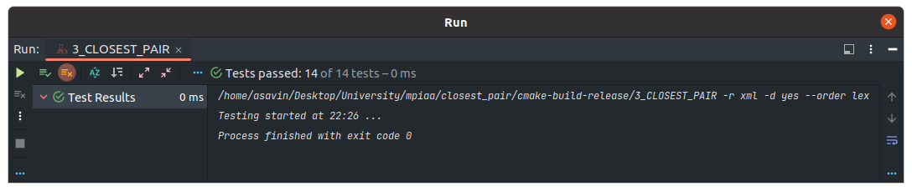

# Практическое занятие №3: Разделяй и властвуй

В работе представлен алгоритм нахождения из множества (вектора) пары ближайших точек. Каждая точка имеет две координаты
(X, Y).

Алгоритм имеет две реализации:

1) native.
2) divide_and_conquer.

За тип используемой реализации отвечает макрос `NATIVE`, в случае `1` - используется нативная реализация,
в случае `0` - "разделяй и властвуй".

### Алгоритмическая сложность

1) native (полный перебор) - O(n^2).
2) divide_and_conquer - O(n * log^2(n))

### Unit-tests

### Замеры времени

Замеры были проведены на release версии с флагом оптимизации -O2

| Algorithm / Point vector size (N) | 1000       | 10000      | 100000      |
|-----------------------------------|------------|------------|-------------|
| native                            | 0.002583 s | 0.304025 s | 20.183306 s | 
| divide_and_conquer                | 0.002311 s | 0.201475 s | 9.561203 s  | 

### Вывод

Метод разделяй и властвуй хорошо подходит, когда выгодно разделять одну большую задачу на несколько меньших и
рекурсивно применять имеющийся алгоритм к более мелких подзадачам. В данном примере использование полного перебора - 
занимает очень много времени. Алгоритм с принципом "разделяй и властвуй" - работает быстрее (на большом количестве 
данных в 2 раза), но нельзя сказать, что он очень хорошо справляется. Связано это с тем, что задача специфична, и в 
ней - сложность данного алгоритма составляет O(n * log^2(n)), т.е. даже больше супер линейной сложности.