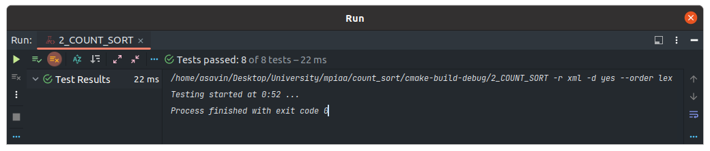

# Практическое занятие №2: Сортировка и поиск

## Часть 1

### Алгоритмическая сложность 

Сортировка подсчётом имеет сложность O(n) либо же O(n + k), в любой из этих оценок, сложность - линейна.

В работе представлена несколько модифицированная сортировка подсчётом, поскольку классический алгоритм предполагает 
соблюдение двух условий:

1) Диапазон значений у сортируемого массива `[0; n]`.
2) Всегда `max != min`. 

### Unit-tests

### Замеры времени

Замеры были проведены на release версии с флагом оптимизации -O2

| Algorithm / Size of array (N) | 1000       | 10000      | 100000     | 1000000    | 10000000   | 
|-------------------------------|------------|------------|------------|------------|------------|
| std::sort                     | 0.000065 s | 0.000864 s | 0.011508 s | 0.125819 s | 1.471975 s |
| count_sort                    | 0.000021 s | 0.000266 s | 0.003166 s | 0.043729 s | 0.451161 s | 

### Вывод

Сортировка подсчётом очень эффективна и имеет алгоритмическую сложность O(n), что лучше даже, чем у сортировки из 
стандартной библиотеки - std::sort O(n * log(n)). Такая эффективность достигается дополнительным выделением памяти под
k элементов, где k = max - min, что при огромных размерах сортируемого массива (контейнера) - будет проблемой.