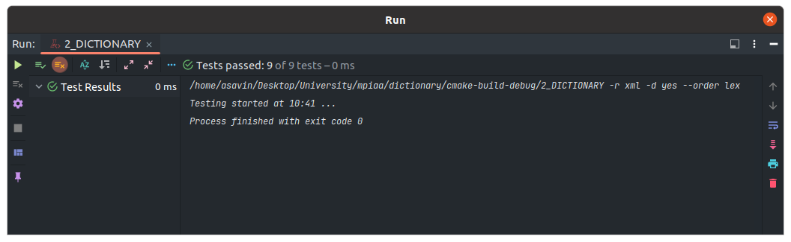

# Практическое занятие №2: Сортировка и поиск

## Часть 2

### Алгоритмическая сложность

Ниже приведены реализованные методы хэш-таблицы:
1) set (insert) O(1).
2) get (find) O(1).

Сложность указана амортизированной, так как в худшем случае, а именно когда хэш-значения всех добавляемых элементов - 
получились одинаковыми (коллизии), алгоритмическая сложность вырождается в линейную O(n).

### Unit-tests

### Замеры времени

Замеры были проведены на release версии с флагом оптимизации -O2

Замер времени для стандартных операций с разными размерами хэш-таблицы.

В случае метода set - размер хэш-таблицы устанавливался `N / 5`, дабы специально получить коллизии и заметную 
разницу во времени при вырождении в линейную сложность.
Размер случайно генерируемых строк был выставлен `4` - чтобы были повторения и метод get находил значения.

Замеры со стандартной хэш-функцией

| Dictionary method / Size (N, M) | 1000, 100  | 10000, 1000 | 100000, 10000 | 1000000, 100000 |
|---------------------------------|------------|-------------|---------------|-----------------|
| set (N)                         | 0.000539 s | 0.007255 s  | 0.093564 s    | 1.114127 s      | 
| get (M)                         | 0.000123 s | 0.002489 s  | 0.216233 s    | 28.645136 s     |

Замеры с хэш-функцией `f(str) = sum(i = 1 ... str.length) str[i]`

| Dictionary method / Size (N, M) | 1000, 100  | 10000, 1000 | 100000, 10000 |
|---------------------------------|------------|-------------|---------------|
| set (N)                         | 0.000504 s | 0.012383 s  | 2.027774 s    | 
| get (M)                         | 0.000123 s | 0.003097 s  | 0.894112 s    |

Замеры с хэш-функцией `f(str) = sum(i = 1 ... str.length) str[i] * a^i`, где `a = 2` 

| Dictionary method / Size (N, M) | 1000, 100  | 10000, 1000 | 100000, 10000 |
|---------------------------------|------------|-------------|---------------|
| set (N)                         | 0.000680 s | 0.010058 s  | 0.688301 s    | 
| get (M)                         | 0.000133 s | 0.002204 s  | 0.256048 s    |

Замеры с хэш-функцией `f(str) = h[str.size]`, `где h[i] = (h[i - 1] << a | h[i - 1] >> b) + str[i]` и `h[0] = c`, где
`a = 3`, `b = 2`, `c = 7`

| Dictionary method / Size (N, M) | 1000, 100  | 10000, 1000 | 100000, 10000 |
|---------------------------------|------------|-------------|---------------|
| set (N)                         | 0.000750 s | 0.009214 s  | 0.196829 s    | 
| get (M)                         | 0.000135 s | 0.002803 s  | 0.210654 s    |

Порядок эффективности для хэш-функций:
1) std::hash
2) hash_3
3) hash_2
4) hash_1

Сравнение методов с методами std::map

| Dictionary method / Size (N, M) | 1000, 100  | 10000, 1000 | 100000, 10000 | 1000000, 100000 |
|---------------------------------|------------|-------------|---------------|-----------------|
| Dictionary set (N)              | 0.000544 s | 0.006803 s  | 0.090665 s    | 0.735718 s      |
| Dictionary get (M)              | 0.000138 s | 0.002181 s  | 0.153525 s    | 27.458068 s     |
| std::map insert (N)             | 0.000793 s | 0.007162 s  | 0.124258 s    | 1.410485 s      |
| std::map find (M)               | 0.000068 s | 0.000563 s  | 0.008483 s    | 0.010042 s      |

### Вывод

Хэщ-таблица - единственная структура данных, которая в амортизированном случае выдаёт константную сложность, как 
для вставки, так и для поиска элемента. У хэш-таблиц есть и недостатки, а именно: Вырождение сложности поиска в 
линейную в случае коллизий (этого я и добивался в замерах), и зависимость от алгоритма хэш-функции. Касаемо 
хэш-функции, как можно было заметить - чем сложнее алгоритм, тем меньше вероятность появления коллизий, что означает
лучшую работу методов контейнера.
