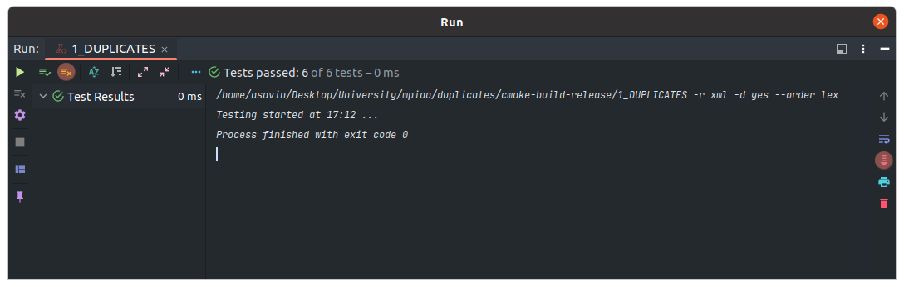

# Практическое занятие №1: Основные структуры данных, простые алгоритмы

## Часть 2

Реализованные алгоритмы подходят как для отсортированных массивов так и для не отсортированных, 
отсюда и большая алгоритмическая сложность в случае наивной реализации.

### Вычислительная сложность для алгоритмов

1) has_duplicates O(n).
2) get_duplicates в наивной реализации O(n^3).
3) get_duplicates в с использованием сортировки O(n * log(n)).

Как уже было указано, для реализации функции get_duplicates с адекватной алгоритмической сложностью - была использована
сортировка std::sort.

За тип реализации отвечает булевский флаг `native_realization` - находящийся в файле `duplicates.cpp`.

### Unit-тесты

### Замеры времени

Замеры были на release версии с флагом оптимизации -O2

Для N = 1000

| Function / Type of values   | Same       | Random     | Unique     |
|-----------------------------|------------|------------|------------|
| has_duplicates              | 0.000001 s | 0.000002 s | 0.000003 s |
| get_duplicates O(n^3)       | 0.003079 s | 0.000582 s | 0.000516 s | 
| get_duplicates O(n * log(n) | 0.000020 s | 0.000108 s | 0.000019 s |

Для N = 10000

| Function / Type of values   | Same       | Random     | Unique     |
|-----------------------------|------------|------------|------------|
| has_duplicates              | 0.000001 s | 0.000005 s | 0.000016 s |
| get_duplicates O(n^3)       | 0.321160 s | 0.036338 s | 0.034288 s |
| get_duplicates O(n * log(n) | 0.000342 s | 0.003391 s | 0.000253 s | 

Для N = 100000

| Function / Type of values   | Same         | Random     | Unique     |
|-----------------------------|--------------|------------|------------|
| has_duplicates              | 0.000008 s   | 0.000003 s | 0.000054 s |
| get_duplicates O(n^3)       | 21.582799 s  | 3.814451 s | 3.693360 s |
| get_duplicates O(n * log(n) | 0.002713 s   | 0.266265 s | 0.002229 s |

Из приведённых данных видно как сильно отличаются временные затраты на 1 и тот же алгоритм в разной реализации.~~
