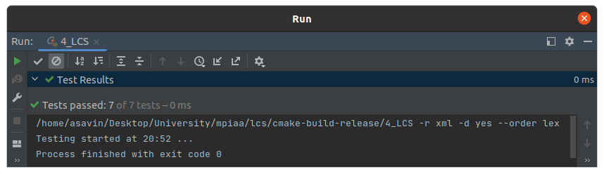

# Практическое занятие № 4: Динамическое программирование, жадные алгоритмы

## Часть 1

В работе представлен алгоритм нахождения наибольшей общей подпоследовательности двух строк `lcs`.
Алгоритм имеет две реализации:
1) native 
2) dynamic

За тип используемой реализации отвечает макрос `NATIVE`, в случае 1 - используется нативная реализация, в случае 0 -
метод динамического программирования.

### Алгоритмическая сложность

1) native (полный перебор) - O(m * 2 ^ n)
2) dynamic - O(m * n) 

В худшем случае m = n.

### Unit-tests

### Замеры времени

Замеры были проведены на `release` версии с флагом оптимизации `-O2`.

Для всех замеров ниже длина первой строки бралась, как `N`, длина второй строки, как `M = N / 2`.

| Algorithm / First string size (N) | 10         | 20         | 22         | 25          | 
|-----------------------------------|------------|------------|------------|-------------|
| native                            | 0.000159 s | 0.933711 s | 6.398499 s | 39.628337 s |

| Algorithm / First string size (N) | 10         | 100        | 1000       | 10000       | 
|-----------------------------------|------------|------------|------------|-------------|
| dynamic                           | 0.000002 s | 0.000046 s | 0.006233 s | 0.831569  s |

Замеры времени на одинаковых входных данных

| Algorithm / First string size (N) | 10         | 20         | 22         | 25          |
|-----------------------------------|------------|------------|------------|-------------|
| native                            | 0.000323 s | 1.133901 s | 6.246171 s | 39.608777 s |
| dynamic                           | 0.000002 s | 0.000005 s | 0.000005 s | 0.000005  s |

### Вывод

Из результатов замеров видно, что нативный алгоритм на строках малой длины работал очень медленно.
Также можно было заметить, что уже при разнице в 3 элемента (22 и 25) - время работы увеличилось почти в 7 раз.
Связано это с тем, что сложность данного алгоритма линейно-экспоненциальная (при m = n)  O(n * 2 ^ n). Что делает
невозможным применение данной реализации при решении реальных задач, ввиду колоссально быстрого роста количества
операций. 

Сложность же алгоритма с использованием метода динамического программирования в худшем случае квадратичная (при m = n)
O(n ^ 2). Наглядную разницу во времени исполнения - продемонстрировали замеры.

