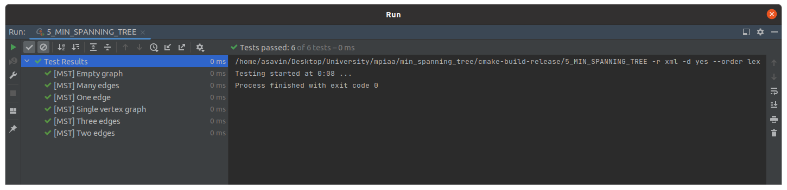

# Практическое занятие №5: Алгоритмы на графах

## Часть 2

В работе представлен алгоритм Прима поиска минимального остовного дерева во взвешенном
неориентированном графе.

### Алгоритмическая сложность

1. min_spanning_tree (алгоритм Прима) - O(n^2)

В данной реализации был представлен самый простой алгоритм без использования бинарной кучи рёбер.

### Unit-tests

### Замеры времени

Замеры были проведены на `release` версии с флагом оптимизации `-O2`.

| Algorithm / Number of vertexes in graph (N) | 10         | 100        | 1000       | 10000      |
|---------------------------------------------|------------|------------|------------|------------|
| min_spanning_tree                           | 0.000023 s | 0.000461 s | 0.071637 s | 7.686814 s |

### Вывод

Алгоритм Прима можно реализовать многими способами, начиная от самого простого со сложностью O(n^2) и до
алгоритма с применением бинарной кучи рёбер со сложностью O(log(n)). Также для задачи поиска минимального остовного
дерева можно использовать алгоритм Крускала.