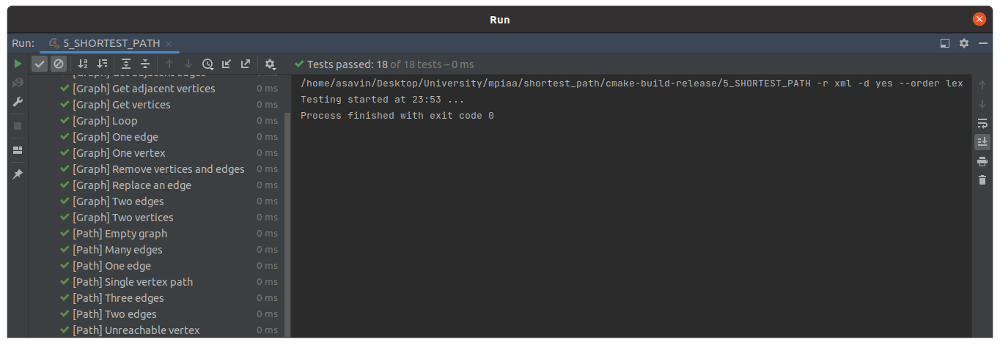

# Практическое занятие №5: Алгоритмы на графах

## Часть 1

В работе представлен алгоритм Дейкстры поиска кратчайшего пути между двумя заданными вершинами во взвешенном 
неориентированном графе. 

### Алгоритмическая сложность

1. shortest_path (алгоритм Дейкстры) - O(n^2)

В данной реализации был представлен самый простой алгоритм без использования фибоначчивой кучи и без использования
разреженных графов.

### Unit-tests

### Замеры времени

Замеры были проведены на `release` версии с флагом оптимизации `-O2`.

| Algorithm / Number of vertexes in graph (N) | 10         | 100        | 1000       | 10000      |
|---------------------------------------------|------------|------------|------------|------------|
| shortest_path                               | 0.000020 s | 0.000409 s | 0.012393 s | 6.465181 s |

### Вывод

Алгоритм Дейкстры можно реализовать многими способами, начиная от самого простого со сложностью O(n^2) и до
алгоритма с применением фибоначчивой кучи со сложностью O(log(n)).