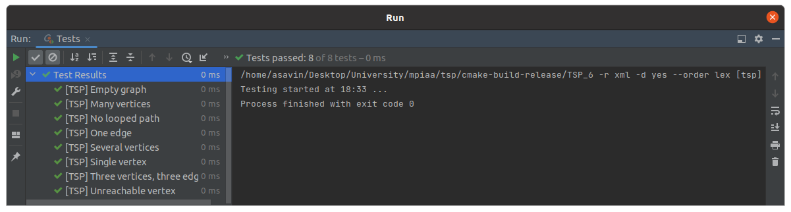

# Практическое занятие №6: NP-полные задачи, метод ветвей и границ

В работе представлены решения задачи коммивояжера (Travelling Salesman Problem, TSP) методом ветвей и границ, 
полным перебором и жадным алгоритмом. Данные алгоритмы дают оптимальное (точное) решение.

## Алгоритмическая сложность 

1. tspBnb (метод ветвей и границ) - O(n^2 * 2^n)
2. native (полный перебор) - O(n!)
3. greedy (жадный алгоритм) - O(n^2)

## Unit-tests

## Замеры времени и длины полученных путей

Замеры были проведены на `release` версии с флагом оптимизации `-O2`.

### Время

| Algorithm / Number of vertices in graph (N) | 7          | 8          | 9          | 10         | 100        | 200        | 1000       |
|---------------------------------------------|------------|------------|------------|------------|------------|------------|------------|
| tspBnb                                      | 0.000283 s | 0.002770 s | 0.023079 s | 0.235570 s | -          | -          | -          |    
| native                                      | 0.012141 s | 0.026008 s | 0.648350 s | 6.515090 s | -          | -          | -          |
| greedy                                      | 0.000009 s | 0.000011 s | 0.000008 s | 0.000010 s | 0.000777 s | 0.005680 s | 0.312882 s |

### Длина путей

| Algorithm / Number of vertices in graph (N) | 7          | 8          | 9          | 10         | 100         | 200         | 1000        |
|---------------------------------------------|------------|------------|------------|------------|-------------|-------------|-------------|
| tspBnb                                      | 222.488423 | 138.057704 | 146.511210 | 213.694628 | -           | -           | -           |    
| native                                      | 192.323421 | 136.321223 | 146.511210 | 208.263844 | -           | -           | -           |
| greedy                                      | 82.541799  | 348.686397 | 72.763447  | 88.983534  | 8127.258530 | 4456.663616 | 4481.245388 |

## Вывод

Для задачи коммивояжера существует множество алгоритмов решений, каждый из которых хорош в какому признаку.
Так например жадный алгоритм - быстрее всего находит решение, но далеко не самое оптимальное.
Алгоритм полного перебора - находит наилучшее из возможных решений, но делает это очень долго. Метод ветвей и границ
является нечто средним, он ищет оптимальное решение (не всегда самое лучше), но гораздо быстрее нежели алгоритм 
полного перебора. 

# Практическое занятие №7: Локальный поиск

В данной работе был дополнено 6 практическое занятие - реализацией алгоритма локального поиска для задачи TSP
(Travelling Salesman Problem). Данный алгоритм даёт субоптимальное решение. В текущей реализации алгоритм реализован 
с помощью 2-opt эвристики.

## Алгоритмическая сложность

1. tspLocalSearch (2-opt) - O(n^3).

В 7 практической работе unit-тесты не представлены, так как алгоритм локального поиска не использует стартовую 
вершину, что не подходит под сигнатуру тестов для 6 практической работы. 

## Замеры времени и длины полученных путей

Замеры были проведены на `release` версии с флагом оптимизации `-O2`. Замеры производились на функции tspLocalSearch 
(алгоритм локального поиска).

| Metric type / Number of vertices in graph (N) | 7           | 8           | 9           | 10          | 100         | 200          |
|-----------------------------------------------|-------------|-------------|-------------|-------------|-------------|--------------|
| time                                          | 0.000023 s  | 0.000027 s  | 0.000055 s  | 0.000064 s  | 1.083653 s  | 14.990572 s  |
| path cost                                     | 407.306264  | 255.891640  | 312.984585  | 420.623197  | 4922.406288 | 10165.982899 |

Учитывая данные из таблиц замеров 6 практической работы - получим следующее сравнение алгоритмов:

### Время

| Algorithm / Number of vertices in graph (N) | 7          | 8          | 9          | 10         | 100        | 200         | 1000       |
|---------------------------------------------|------------|------------|------------|------------|------------|-------------|------------|
| tspBnb                                      | 0.000283 s | 0.002770 s | 0.023079 s | 0.235570 s | -          | -           | -          |    
| native                                      | 0.012141 s | 0.026008 s | 0.648350 s | 6.515090 s | -          | -           | -          |
| greedy                                      | 0.000009 s | 0.000011 s | 0.000008 s | 0.000010 s | 0.000777 s | 0.005680 s  | 0.312882 s |
| tspLocalSearch                              | 0.000023 s | 0.000027 s | 0.000055 s | 0.000064 s | 1.083653 s | 14.990572 s | -          | 

### Длина путей

| Algorithm / Number of vertices in graph (N) | 7          | 8          | 9          | 10         | 100         | 200          | 1000        |
|---------------------------------------------|------------|------------|------------|------------|-------------|--------------|-------------|
| tspBnb                                      | 222.488423 | 138.057704 | 146.511210 | 213.694628 | -           | -            | -           |    
| native                                      | 192.323421 | 136.321223 | 146.511210 | 208.263844 | -           | -            | -           |
| greedy                                      | 82.541799  | 348.686397 | 72.763447  | 88.983534  | 8127.258530 | 4456.663616  | 4481.245388 |
| tspLocalSearch                              | 407.306264 | 255.891640 | 312.984585 | 420.623197 | 4922.406288 | 10165.982899 | -           |

## Вывод

Как можно заметить, алгоритм локального поиска с 2-opt эвристикой - имеет сравнительно меньшую временную сложность 
нежели алгоритмы полного перебора, ветвей и границ. За счёт чего скорость работы многократно выше, но, как уже 
было сказано алгоритм локального поиска находит субоптимальное решение, это расхождение в точности в сравнении 
с другими алгоритмами можно наблюдать на результатах тестирования. Данное алгоритм подойдет при поиске пути - 
в графе с очень большим количеством вершин. 