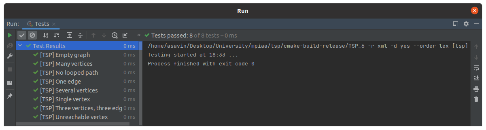

# Практическое занятие №6: NP-полные задачи, метод ветвей и границ

В работе представлены решения задачи коммивояжера (Travelling Salesman Problem, TSP) методом ветвей и границ, 
полным перебором и жадным алгоритмом. 

## Алгоритмическая сложность 

1. tspBnb (метод ветвей и границ) - O(n^2 * 2^n)
2. native (полный перебор) - O(n!)
3. greedy (жадный алгоритм) - O(n^2)

## Unit-tests

## Замеры времени и длины полученных путей

Замеры были проведены на `release` версии с флагом оптимизации `-O2`.

### Время

| Algorithm / Number of vertexes in graph (N)  | 7          | 8          | 9          | 10         |
|----------------------------------------------|------------|------------|------------|------------|
| tspBnb                                       | 0.000283 s | 0.002770 s | 0.023079 s | 0.235570 s |    
| native                                       | 0.012141 s | 0.026008 s | 0.648350 s | 6.515090 s |
| greedy                                       | 0.000009 s | 0.000011 s | 0.000008 s | 0.000010 s |

### Длина путей

| Algorithm / Number of vertexes in graph (N)  | 7           | 8          | 9          | 10         |
|----------------------------------------------|-------------|------------|------------|------------|
| tspBnb                                       | 222.488423  | 138.057704 | 146.511210 | 213.694628 |    
| native                                       | 192.323421  | 136.321223 | 146.511210 | 208.263844 |
| greedy                                       | 240.232113  | 172.386312 | 198.329762 | 324.607814 |

## Вывод

Для задачи коммивояжера существует множество алгоритмов решений, каждый из которых хорош в какому признаку.
Так например жадный алгоритм - быстрее всего находит решение, но далеко не самое оптимальное.
Алгоритм полного перебора - находит наилучшее из возможных решений, но делает это очень долго. Метод ветвей и границ
является нечто средним, он ищет оптимальное решение (не всегда самое лучше), но гораздо быстрее нежели алгоритм 
полного перебора. 

